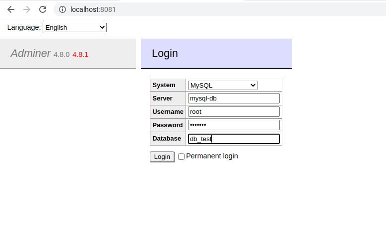
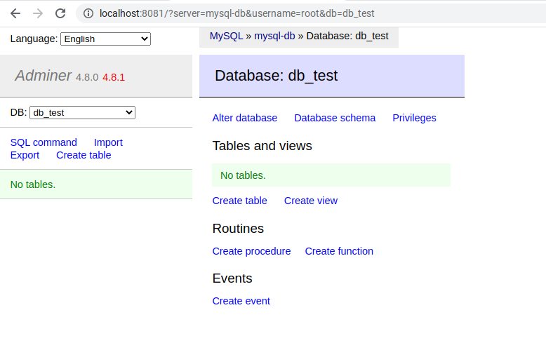

# Install MySQL dan Adminer Menggunakan Docker Compose

#### Cara Menggunakan
1. Buat Direktory `database-data`
2. Ganti Value
    ```
    MYSQL_ROOT_PASSWORD: 
    MYSQL_DATABASE: 
    MYSQL_USER: 
    MYSQL_PASSWORD: 
    ```
    sesuai dengan kebutuhan

3. Eksekusi Perintah `docker-compose up -d` untuk menjalankan MySQL dan Adminier
4. Eksekusi Perintah `docker-compose down` untuk menghentikan dan menghapus MySQL dan Adminer

#### Verifikasi dengan login ke Adminer



